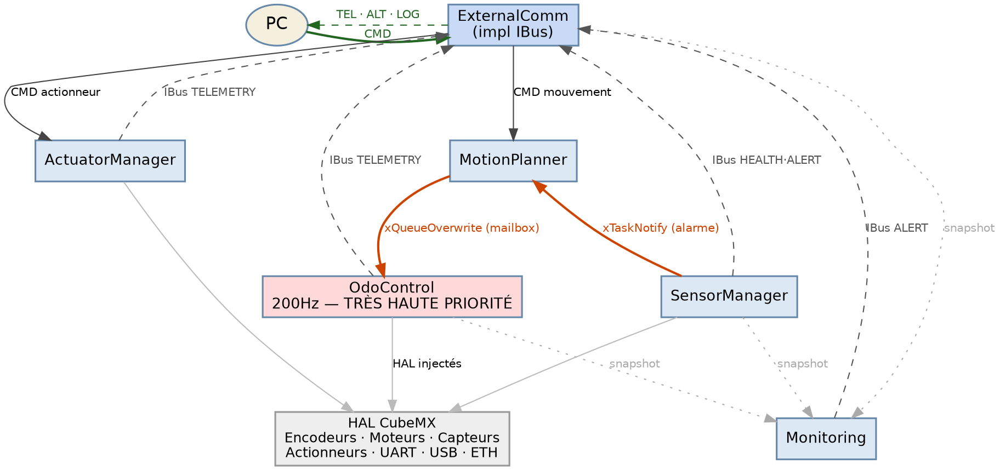

# Architecture Decision Document

_Ce document se construit collaborativement à travers une découverte étape par étape. Les sections sont ajoutées au fil de nos décisions architecturales communes._

## Project Context Analysis

### Requirements Overview

**Functional Requirements:**
- Contrôle moteur en boucle fermée (PID, 200Hz) avec odométrie encodeurs gauche/droite
- Gestion capteurs : proximité, température, courant (jusqu'à 15 capteurs via ISensor)
- Gestion actionneurs : pompes, servomoteurs, transducteurs linéaires (jusqu'à 10 via IActuator)
- Communication externe tri-canal : UART (commande terrain), USB (supervision), Ethernet (réseau)
- Planification de trajectoire réactive aux alarmes capteurs
- Monitoring et agrégation de télémétrie en temps quasi-réel

**Non-Functional Requirements:**
- Déterminisme temps-réel : OdoControl 200Hz non-interruptible, latence alarmes ≤1 tick FreeRTOS
- Zéro allocation dynamique : `new`/`delete` interdits, heap non utilisé, empreinte mémoire compile-time
- Publications IBus non-bloquantes (overwrite/drop) : aucune inversion de priorité possible par construction
- Testabilité : injection de dépendance systématique (IBus*, HAL*) pour mocks sans matériel
- Extensibilité : ajout capteur/actionneur = nouvelle classe concrète uniquement, zéro modification existant

**Scale & Complexity:**
- Domaine primaire : Embedded C++ / STM32 HAL + FreeRTOS CMSIS V2
- Niveau de complexité : **Haute** — contraintes temps-réel strictes + multi-tâches + hardware constraints
- Composants architecturaux estimés : 8 classes métier, 4 interfaces domaine, 9 interfaces HAL, 6 tâches FreeRTOS

### Technical Constraints & Dependencies

- **Plateforme** : STM32 (CubeMX généré), HAL Cube, FreeRTOS CMSIS V2
- **Langage** : C++ orienté objet, sans exceptions, sans RTTI
- **Mémoire** : Statique uniquement — tableaux de taille fixe (MAX_SENSORS=15, MAX_ACTUATORS=10)
- **Scheduling** : Préemptif FreeRTOS — priorités explicites requises pour chaque tâche
- **Point d'entrée système** : `SystemInit::boot()` câble tout — `main.cpp` = 3 lignes

### Cross-Cutting Concerns Identified

- **Temps-réel** : Toutes décisions doivent préserver le déterminisme de OdoControl (aucun blocking sur chemin critique)
- **Sécurité** : `xQueueReset()` comme primitif d'arrêt d'urgence universel — propager ce pattern
- **Observabilité** : IBus est le seul canal de sortie — chaque module doit publier son état de santé
- **Injection de dépendance** : Toutes les dépendances passent par le constructeur — `SystemInit` est l'unique point de câblage

## Starter Template Evaluation

### Primary Technology Domain

Embedded C++ / Bare-metal + RTOS — plateforme STM32 avec HAL CubeMX et FreeRTOS CMSIS V2.

### Starter Options Considered

Aucun starter template générique n'existe pour STM32 C++ OO. La fondation standard est la génération CubeMX, point de départ universel pour ce domaine.

### Selected Starter: STM32CubeMX Generated Project

**Rationale for Selection:**
- Génère la configuration HAL complète (horloges, périphériques, DMA, IRQ)
- Intègre FreeRTOS CMSIS V2 nativement
- Produit le `main.c` remplacé par `main.cpp` + `SystemInit::boot()`
- Seule approche maintenue officiellement par STMicroelectronics

**Initialisation du projet:**

```bash
# Via STM32CubeIDE ou STM32CubeMX :
# 1. Créer projet STM32 pour la cible exacte
# 2. Activer FreeRTOS (CMSIS V2)
# 3. Configurer périphériques : TIM (encodeurs), PWM (moteurs), UART, USB, ETH
# 4. Générer le code
# 5. Renommer main.c → main.cpp, ajouter SystemInit::boot()
```

**Architectural Decisions Provided by Starter:**

**Language & Runtime:**
C++17 sans exceptions, sans RTTI — flags compilateur `-fno-exceptions -fno-rtti`

**Build Tooling:**
STM32CubeIDE (Eclipse + ARM GCC) ou Makefile généré par CubeMX

**Testing Framework:**
Tests unitaires sur host via Google Test + mocks HAL injectés — tests d'intégration sur cible via UART/USB

**Structure du projet:**

```
Core/
  Inc/         ← interfaces HAL générées (CubeMX)
  Src/         ← main.cpp (3 lignes : SystemInit::boot() + vTaskStartScheduler())
App/
  Interfaces/  ← tous les contrats I*.h (IBus, ISensor, IActuator, IMotorHAL, etc.)
  Drivers/     ← pilotent directement le HW via registres STM32 / HAL CubeMX
               │   Encoder.h/.cpp, Drv8262.h/.cpp, Motor.h/.cpp
               └── UartChannel.h/.cpp, UsbCdcChannel.h/.cpp
  Services/    ← orchestrent des Drivers via interfaces, sans toucher le HW
               └── Odometry.h/.cpp
  Controllers/ ← algorithmes purs, zéro dépendance FreeRTOS ou HW
               └── Pid.h/.cpp (+ futurs filtres, régulateurs...)
  Tasks/       ← tâches FreeRTOS uniquement (boucle infinie ou osThreadNew)
               │   OdoControl.h/.cpp      (1 tâche 200Hz, vTaskDelayUntil)
               │   MotionPlanner.h/.cpp   (1 tâche event-driven, xTaskNotify)
               │   SensorManager.h/.cpp   (1 tâche polling, vTaskDelay)
               │   Monitoring.h/.cpp      (1 tâche queue-driven, IBus)
               └── ExternalComm.h/.cpp    (2 tâches : rxTask + txTask, impl IBus)
  SystemInit/  ← SystemInit.h/.cpp (câblage statique complet, zéro new)
Drivers/       ← HAL CubeMX généré (ne pas modifier manuellement)
Middlewares/   ← FreeRTOS CMSIS V2 (ne pas modifier manuellement)
```

**Convention Tasks/ :** `ExternalComm` a deux entry points statiques (`rxTask`, `txTask`) créés par `SystemInit` — une seule classe, deux `xTaskCreate`. Un fichier = une classe = N tâches FreeRTOS possibles si la classe les gère toutes.

**Note:** La première story d'implémentation = créer le projet CubeMX avec la configuration hardware complète et valider que FreeRTOS démarre avec une tâche vide.

## Core Architectural Decisions

### Decision Priority Analysis

**Décisions critiques (bloquent l'implémentation) :**
- Protocole de communication ASCII Option A
- Format messages : `TOPIC payload\n`
- Gestion des erreurs via IBus ALERT

**Décisions importantes (structurent l'architecture) :**
- Configuration système `constexpr` compile-time

**Décisions différées :**
- Migration protocole ASCII → binaire si débit insuffisant (post-validation)
- Watchdog hardware : non requis (supervision humaine permanente)

### Communication Protocol

**Protocole :** ASCII Option A — `TOPIC PAYLOAD\n`

Mapping topics IBus ↔ préfixes ASCII :

| IBus Topic   | Préfixe ASCII | Direction      |
|--------------|---------------|----------------|
| —            | `CMD`         | PC → Robot     |
| `TELEMETRY`  | `TEL`         | Robot → PC     |
| `ALERT`      | `ALT`         | Robot → PC     |
| `LOG`        | `LOG`         | Robot → PC     |
| `HEALTH`     | `HLT`         | Robot → PC     |

**Exemples de messages :**
```
# PC → Robot
CMD MOVE 0.5 0.3\n
CMD ACTUATOR PUMP_1 ON\n

# Robot → PC
TEL ODO 1.23 0.45 90.0\n
ALT PROXIMITY_LOW 0.12\n
LOG INFO SystemInit OK\n
HLT TEMP 36.5 CURRENT 1.2\n
```

**Parsing côté STM32 :** `sscanf` sur buffer UART, dispatch sur premier token (`CMD`).
**Parsing côté PC :** split sur espace, premier token = topic, reste = payload.

### System Configuration

**Stratégie :** `constexpr` compile-time dans un header dédié `App/Config.h`

```cpp
namespace Config {
    static constexpr uint32_t ODO_FREQ_HZ      = 200;
    static constexpr uint8_t  MAX_SENSORS      = 15;
    static constexpr uint8_t  MAX_ACTUATORS    = 10;
    static constexpr float    PID_KP_DEFAULT   = 1.0f;
    static constexpr float    PID_KI_DEFAULT   = 0.1f;
    static constexpr float    PID_KD_DEFAULT   = 0.05f;
}
```

Avantage : empreinte mémoire nulle, optimisation compile-time complète, valeurs visibles dans le code.

### Error Handling

**Stratégie :** Sans exceptions C++ (`-fno-exceptions`).

Toute erreur critique est publiée sur IBus topic `ALERT` :
```cpp
bus_->publish(Topic::ALERT, "ALT HAL_ERROR MOTOR_L\n");
```

Les erreurs non-critiques (timeout, donnée obsolète) sont publiées sur `LOG` :
```cpp
bus_->publish(Topic::LOG, "LOG WARN Sensor timeout ID=3\n");
```

`Monitoring` souscrit à `ALERT` et agrège — aucun module ne connaît `Monitoring` directement.

### Monitoring — Accès aux données (Pull model)

**Décision :** `Monitoring` utilise un modèle **pull avec shared memory horodatée**. Chaque module qui expose des données de santé déclare une struct statique publique avec timestamp. `Monitoring` poll ces structs périodiquement. IBus est inchangé.

**Pattern par module :**

```cpp
// Dans OdoControl.h
struct OdoSnapshot {
    float x, y, angle;
    float speedLeft, speedRight;
    uint32_t timestamp; // HAL_GetTick()
};
static OdoSnapshot latestSnapshot; // écrit par OdoControl, lu par Monitoring
```

`OdoControl` met à jour `latestSnapshot` à chaque tick 200Hz. Le writer (haute priorité) n'a pas besoin de section critique — il ne peut pas être préempté par `Monitoring`. Le reader (`Monitoring`, basse priorité) DOIT protéger la copie avec `taskENTER_CRITICAL()` / `taskEXIT_CRITICAL()` pour éviter un torn read (une struct multi-champs n'est pas atomique sur ARM Cortex-M) :

```cpp
// Writer — OdoControl (TRÈS HAUTE priorité) : pas de critical section nécessaire
latestSnapshot = { _x, _y, _angle, _speedLeft, _speedRight, HAL_GetTick() };

// Reader — Monitoring (BASSE priorité) : critical section obligatoire
OdoControl::OdoSnapshot snap;
taskENTER_CRITICAL();
snap = OdoControl::latestSnapshot;
taskEXIT_CRITICAL();
// Utiliser snap hors critical section
```

La section critique côté lecteur dure ~50ns à 168MHz (copie de ~24 octets) — aucun impact sur le déterminisme d'OdoControl. `Monitoring` lit la struct et vérifie le timestamp pour détecter une donnée obsolète.

**Modules exposant une snapshot :**
- `OdoControl::OdoSnapshot` — vitesse, position, erreur PID
- `SensorManager::SensorSnapshot` — état de chaque capteur, dernière valeur lue
- `ExternalComm::CommSnapshot` — compteurs RX/TX, dernière commande reçue

**Règle :** Les snapshots sont `static` dans la classe, initialisées à zéro dans `SystemInit`. `Monitoring` ne connaît que les types concrets des snapshots, pas les instances des tâches.

**Détection de donnée obsolète :** Si `HAL_GetTick() - snapshot.timestamp > Config::MONITORING_STALE_MS`, `Monitoring` publie une alerte sur IBus.

### Watchdog

Non requis — le robot opère sous supervision humaine permanente. Simplifie l'architecture des tâches (pas de kick watchdog à distribuer).

### Decision Impact Analysis

**Séquence d'implémentation imposée par ces décisions :**
1. `App/Config.h` — toutes les constantes, compilé en premier
2. `App/Interfaces/` — contrats IBus, ISensor, IActuator
3. `ExternalComm` — implémente IBus, parseur ASCII CMD, formatter TEL/ALT/LOG/HLT
4. `SystemInit` — câble tout, instancie les queues BUS_CONFIG

**Dépendances croisées :**
- Toute classe qui publie sur IBus doit connaître le format ASCII de son topic
- `ExternalComm` est le seul producteur de bytes série — toutes les sorties passent par lui

## Implementation Patterns & Consistency Rules

### Naming Patterns

**Membres privés :** préfixe underscore
```cpp
float _x, _y, _angle;
IBus* _bus;
IMotorHAL* _motorLeft;
```

**Constantes :** ALL_CAPS dans `namespace Config`
```cpp
namespace Config {
    static constexpr uint32_t ODO_FREQ_HZ    = 200;
    static constexpr uint8_t  MAX_SENSORS    = 15;
    static constexpr uint16_t STACK_ODO      = 512;
    static constexpr UBaseType_t PRIO_ODO    = 5;
}
```

**Interfaces :** préfixe `I` — `IBus`, `ISensor`, `IActuator`
**Classes métier :** PascalCase — `OdoControl`, `MotionPlanner`
**Fichiers :** PascalCase identique à la classe — `OdoControl.h/.cpp`

### Header Guards

Convention : `APP_<DOSSIER>_<FICHIER>_H`

```cpp
// App/Tasks/
#ifndef APP_TASKS_ODOCONTROL_H

// App/Drivers/
#ifndef APP_DRIVERS_MOTOR_H

// App/Services/
#ifndef APP_SERVICES_ODOMETRY_H

// App/Controllers/
#ifndef APP_CONTROLLERS_PID_H

// App/Interfaces/
#ifndef APP_INTERFACES_IBUS_H
```

### IBus Message Formatting

Tous les modules utilisent `BusFormat` (`App/BusFormat.h`) — jamais de `snprintf` inline :

```cpp
// ✅ Correct
bus_->publish(Topic::TELEMETRY, BusFormat::telOdo(x, y, angle));
bus_->publish(Topic::ALERT,     BusFormat::altProximity(distance));
bus_->publish(Topic::LOG,       BusFormat::logInfo("SystemInit OK"));

// ❌ Interdit — snprintf inline
char buf[64];
snprintf(buf, sizeof(buf), "TEL ODO %.2f\n", x);
bus_->publish(Topic::TELEMETRY, buf);
```

`BusFormat` centralise le format ASCII — un seul endroit à modifier si le protocole évolue.

### FreeRTOS Configuration

Stacks et priorités dans `App/Config.h` uniquement — jamais définis localement dans les fichiers Tasks :

```cpp
namespace Config {
    // Stacks (en mots de 32 bits)
    static constexpr uint16_t STACK_ODO_CONTROL    = 512;
    static constexpr uint16_t STACK_MOTION_PLANNER = 256;
    static constexpr uint16_t STACK_SENSOR_MANAGER = 256;
    static constexpr uint16_t STACK_MONITORING     = 256;
    static constexpr uint16_t STACK_EXTCOMM_RX     = 256;
    static constexpr uint16_t STACK_EXTCOMM_TX     = 256;

    // Priorités FreeRTOS (plus haute = plus prioritaire)
    static constexpr UBaseType_t PRIO_ODO_CONTROL    = 5;
    static constexpr UBaseType_t PRIO_MOTION_PLANNER = 4;
    static constexpr UBaseType_t PRIO_EXTCOMM_RX     = 4;
    static constexpr UBaseType_t PRIO_EXTCOMM_TX     = 3;
    static constexpr UBaseType_t PRIO_SENSOR_MANAGER = 2;
    static constexpr UBaseType_t PRIO_MONITORING     = 1;
}
```

### Language Convention

**Tout identifiant est en anglais sans exception :** noms de classes, méthodes, variables, membres, constantes, fichiers, guards, topics IBus, messages ASCII.

```cpp
// ✅ Correct
float _leftWheelSpeed;
void computeOdometry();
static constexpr uint32_t ODO_FREQ_HZ = 200;

// ❌ Interdit
float _vitesseRoueGauche;
void calculerOdometrie();
```

**Commentaires :** en anglais uniquement, et utilisés avec parcimonie. Les noms doivent être suffisamment explicites pour se passer de commentaire. Un commentaire est justifié uniquement pour expliquer un *pourquoi* non-évident (contrainte hardware, invariant subtil, workaround).

```cpp
// ✅ Justifié — explique un pourquoi non-évident
xQueuePeek(_setpointMailbox, &sp, 0); // non-blocking: never suspend at 200Hz

// ❌ Inutile — le nom dit déjà tout
float _leftWheelSpeed; // left wheel speed
void stop();           // stops the motor
```

### Enforcement — Règles Obligatoires

**Tout développeur/agent DOIT :**
- Écrire tous les identifiants et commentaires en anglais
- Préfixer les membres privés avec `_`
- Utiliser `BusFormat::` pour toute publication IBus, jamais de `snprintf` inline
- Déclarer stacks et priorités FreeRTOS dans `Config.h` uniquement
- Utiliser les guards `#ifndef APP_<DOSSIER>_<FICHIER>_H`
- Nommer chaque fichier identiquement à la classe qu'il contient (PascalCase)
- Ne jamais utiliser `new` ou `delete` — allocation statique uniquement
- Choisir des noms suffisamment explicites pour éviter les commentaires descriptifs
- **Développer UNIQUEMENT dans `App/` et `Tests/`** — tout autre dossier (`Core/`, `Drivers/`, `Middlewares/`) est autogénéré par CubeMX et ne doit jamais être modifié manuellement
- **Respecter les critères de dossier** : `Drivers/` = pilote le HW directement · `Services/` = orchestre des Drivers via interfaces · `Controllers/` = algorithme pur sans HW ni FreeRTOS · `Tasks/` = tâche FreeRTOS avec boucle infinie · `Interfaces/` = contrat `I*.h` uniquement

## Project Structure & Boundaries

### Complete Project Directory Structure

```
robot-cdr/
├── Core/                          ← généré CubeMX (ne pas modifier)
│   ├── Inc/
│   │   ├── main.h
│   │   ├── FreeRTOSConfig.h
│   │   └── stm32xxxx_hal_conf.h
│   └── Src/
│       ├── main.cpp               ← 3 lignes : boot() + vTaskStartScheduler()
│       ├── stm32xxxx_hal_msp.c
│       └── stm32xxxx_it.c         ← ISR handlers
│
├── App/
│   ├── Config.h                   ← toutes les constexpr (fréq, stacks, prios, PID)
│   │
│   ├── Interfaces/                ← contrats purs I*.h, aucune implémentation
│   │   ├── IBus.h
│   │   ├── ISensor.h
│   │   ├── IActuator.h
│   │   ├── IActuatorManager.h
│   │   ├── ICommChannel.h
│   │   ├── IEncoderHAL.h
│   │   ├── IMotorHAL.h
│   │   ├── IOdomHAL.h
│   │   └── ISensorHAL.h
│   │
│   ├── Drivers/                   ← pilotent directement le HW (registres STM32 / HAL CubeMX)
│   │   ├── Drv8262.h/.cpp         ← pilote le circuit DRV8262 via GPIO/PWM
│   │   ├── Encoder.h/.cpp         ← lit les timers encodeurs via HAL
│   │   ├── UartChannel.h/.cpp     ← canal UART via HAL_UART
│   │   └── UsbCdcChannel.h/.cpp   ← canal USB CDC via HAL USB
│   │
│   ├── Services/                  ← orchestrent des Drivers via interfaces, sans toucher le HW
│   │   ├── Motor.h/.cpp           ← commande un moteur via Drv8262
│   │   ├── Odometry.h/.cpp        ← calcul position/vitesse à partir de IEncoderHAL
│   │   └── BusFormat.h/.cpp       ← helpers formatage ASCII IBus
│   │
│   ├── Controllers/               ← algorithmes purs, zéro dépendance FreeRTOS ou HW
│   │   └── Pid.h/.cpp             ← régulateur PID générique
│   │
│   ├── Tasks/                     ← tâches FreeRTOS uniquement (boucle infinie ou osThreadNew)
│   │   ├── OdoControl.h/.cpp      ← 1 tâche 200Hz, vTaskDelayUntil
│   │   ├── MotionPlanner.h/.cpp   ← 1 tâche event-driven, xTaskNotify
│   │   ├── SensorManager.h/.cpp   ← 1 tâche polling, ISensor[MAX_SENSORS]
│   │   ├── Monitoring.h/.cpp      ← 1 tâche queue-driven, seuils/alertes
│   │   └── ExternalComm.h/.cpp    ← 2 tâches rxTask+txTask, impl IBus
│   │
│   └── SystemInit/
│       ├── SystemInit.h
│       └── SystemInit.cpp         ← boot(), câblage statique complet, zéro new
│
├── Drivers/                       ← généré CubeMX (ne pas modifier)
│   ├── STM32xxxx_HAL_Driver/
│   └── CMSIS/
│
├── Middlewares/                   ← généré CubeMX (ne pas modifier)
│   └── FreeRTOS/
│
└── Tests/                         ← tests unitaires sur host (Google Test)
    ├── CMakeLists.txt
    ├── Mocks/                     ← utilisent MOCK_METHOD GMock, vérifient les appels
    │   ├── MockBus.h
    │   ├── MockCommChannel.h
    │   ├── MockEncoderHAL.h
    │   ├── MockMotorHAL.h
    │   ├── MockOdomHAL.h
    │   ├── MockSensorHAL.h
    │   └── MockHAL.h
    ├── Stubs/                     ← implémentations minimales sans GMock, simulent l'environnement embarqué
    │   ├── FreeRTOS.h / FreeRTOSStub.cpp
    │   ├── queue.h / task.h
    │   ├── stm32f4xx_hal.h
    │   └── StaticDefs.cpp
    └── Unit/                      ← fichiers *Test.cpp, un par classe testée
        ├── OdoControlTest.cpp
        ├── MotionPlannerTest.cpp
        ├── ExternalCommTest.cpp
        └── BusFormatTest.cpp
```

### Folder Belonging Criteria

| Dossier | Critère d'appartenance |
|---------|----------------------|
| `App/Interfaces/` | Contrat pur `I*.h` — aucune implémentation, aucune dépendance HW |
| `App/Drivers/` | Parle directement au HW via registres STM32 ou HAL CubeMX — implémente une `I***HAL` ou `ICommChannel` |
| `App/Services/` | Orchestre un ou plusieurs Drivers **via leurs interfaces** — aucun appel HAL direct, pas une tâche FreeRTOS |
| `App/Controllers/` | Algorithme pur — zéro dépendance FreeRTOS, zéro dépendance HW, testable sans matériel |
| `App/Tasks/` | Hérite ou instancie une tâche FreeRTOS — contient obligatoirement une boucle infinie ou `osThreadNew` |
| `Tests/Mocks/` | Utilise `MOCK_METHOD` GMock — vérifie que les appels ont bien eu lieu |
| `Tests/Stubs/` | Implémentation minimale sans GMock — permet de compiler les tests sur host sans matériel |
| `Tests/Unit/` | Fichiers `*Test.cpp` — un fichier par classe testée |

### Architectural Boundaries

**1. `App/` ne peut pas accéder directement à `Drivers/` HAL CubeMX**

Les fonctions HAL générées (`HAL_GPIO_WritePin`, `HAL_TIM_ReadCapturedValue`, etc.) ne doivent jamais être appelées directement depuis une classe métier. On passe toujours par une interface injectée (`IMotorHAL*`, `IEncoderHAL*`). Si CubeMX regénère les fichiers HAL, le code métier reste intact. Les tests unitaires sur PC injectent un mock sans matériel.

**2. Une tâche ne peut pas appeler directement une autre tâche**

`OdoControl` ne peut pas appeler une méthode de `MotionPlanner`. `SensorManager` ne peut pas appeler une méthode d'`ExternalComm`. La seule communication inter-tâches autorisée est via IBus (`publish`) ou via les primitives FreeRTOS natives (`xTaskNotify`, `xQueueOverwrite`). Appeler directement une méthode d'une autre tâche crée du couplage fort, risque d'inversion de priorité, et rend le test unitaire impossible.

**3. Une tâche ne peut pas instancier ou utiliser un driver custom directement**

`SensorManager` ne crée pas un `VL53L0X` en interne — il reçoit un tableau d'`ISensor*` déjà instanciés par `SystemInit`. L'implémentation concrète est injectée. On peut ajouter un capteur en créant une nouvelle classe concrète sans toucher `SensorManager`.

**4. `SystemInit` est le seul endroit qui instancie et câble**

Aucune classe ne crée d'instance en dehors de `SystemInit::boot()`. Toutes les instances sont en mémoire statique, tous les pointeurs injectés via constructeurs. Zéro allocation dynamique, empreinte mémoire connue à la compilation, et un seul endroit pour comprendre le câblage complet du système.

### Requirements to Structure Mapping

| Fonctionnalité | Fichier(s) |
|----------------|------------|
| Locomotion PID + odométrie | `Tasks/OdoControl` + `Services/Odometry` + `Controllers/Pid` |
| Planification trajectoire + réactivité alarmes | `Tasks/MotionPlanner` |
| Pilotage moteurs HW | `Drivers/Motor` + `Drivers/Drv8262` |
| Lecture encodeurs HW | `Drivers/Encoder` |
| Acquisition capteurs | `Tasks/SensorManager` |
| Commande actionneurs | `Tasks/ExternalComm` → `IActuatorManager` |
| Supervision et agrégation télémétrie | `Tasks/Monitoring` |
| Communication PC UART | `Drivers/UartChannel` → `Tasks/ExternalComm` |
| Communication PC USB | `Drivers/UsbCdcChannel` → `Tasks/ExternalComm` |
| Contrats inter-modules | `App/Interfaces/` |
| Format messages ASCII | `App/Services/BusFormat.h/.cpp` |
| Toutes les constantes | `App/Config.h` |
| Câblage système | `App/SystemInit/SystemInit.cpp` |

### Data Flow

```
PC → UART/USB/ETH → ExternalComm::rxTask → MotionPlanner  (CMD MOVE)
                                          → ActuatorManager (CMD ACTUATOR)

Encodeurs → OdoControl → PID → Moteurs
OdoControl → IBus (TEL ODO) → ExternalComm::txTask → PC

SensorManager → xTaskNotify → MotionPlanner (alarme critique)
SensorManager → IBus (ALT/HLT) → ExternalComm::txTask → PC

Tous modules → IBus (LOG) → ExternalComm::txTask → PC
```

### Dependency Graph

> **Légende :** vert = communication PC ↔ ExternalComm · rouge = flux temps-réel FreeRTOS (`xQueueOverwrite`, `xTaskNotify`) · tirets gris = publications IBus · pointillés = snapshots pull (Monitoring) · gris clair = interfaces HAL injectées

Source Graphviz (`dependency-graph.dot`) :



## Architecture Validation Results

### Coherence Validation ✅

**Decision Compatibility :** IBus + injection de dépendance + zéro `new` + `SystemInit` forment un système cohérent sans contradictions. Les priorités FreeRTOS respectent la hiérarchie temps-réel. Le format ASCII est cohérent avec `BusFormat` centralisé.

**Pattern Consistency :** Les conventions de nommage (`_prefix`, `ALL_CAPS`, `PascalCase`) sont uniformes. La règle "aucune tâche n'appelle directement une autre tâche" est respectée partout — `ExternalComm` → `ActuatorManager` via queue, pas via appel direct.

**Structure Alignment :** La structure `App/` supporte toutes les décisions. Les frontières sont claires et applicables. `SystemInit` est le seul point de câblage.

### Requirements Coverage Validation ✅

| Exigence | Couverture |
|----------|------------|
| Contrôle moteur 200Hz | `OdoControl` + mailbox |
| Odométrie encodeurs | `OdoControl` seul lecteur `IEncoderHAL` |
| Capteurs (jusqu'à 15) | `SensorManager` + `ISensor[MAX_SENSORS]` |
| Actionneurs (jusqu'à 10) | `ActuatorManager` + `IActuator[MAX_ACTUATORS]` |
| Communication PC tri-canal | `ExternalComm` UART/USB/ETH ASCII |
| Alarmes rapides ≤1 tick | `xTaskNotify` bitmask |
| Télémétrie | IBus → `ExternalComm::txTask` |
| Extensibilité capteurs/actionneurs | `ISensor`/`IActuator` — nouvelle classe uniquement |
| Tests unitaires sans hardware | Interfaces HAL + mocks injectés |

### Implementation Readiness Validation ✅

Tous les agents/développeurs disposent de :
- Contrats d'interface complets (`App/Interfaces/` + `App/Interfaces/HAL/`)
- Règles de nommage et de structure explicites
- Format de communication défini (`BusFormat`)
- Configuration centralisée (`Config.h`)
- Un seul point de câblage (`SystemInit`)

### Architecture Completeness Checklist

**Requirements Analysis**
- [x] Project context thoroughly analyzed
- [x] Scale and complexity assessed
- [x] Technical constraints identified
- [x] Cross-cutting concerns mapped

**Architectural Decisions**
- [x] Critical decisions documented
- [x] Technology stack fully specified
- [x] Integration patterns defined
- [x] Performance considerations addressed

**Implementation Patterns**
- [x] Naming conventions established
- [x] Structure patterns defined
- [x] Communication patterns specified
- [x] Process patterns documented

**Project Structure**
- [x] Complete directory structure defined
- [x] Component boundaries established
- [x] Integration points mapped
- [x] Requirements to structure mapping complete

### Architecture Readiness Assessment

**Overall Status :** READY FOR IMPLEMENTATION

**Confidence Level :** Haute — toutes les décisions critiques sont prises, les frontières sont claires, les patterns sont applicables immédiatement.

**Key Strengths :**
- Zéro allocation dynamique — empreinte mémoire prévisible
- IBus découple tous les modules — testabilité native
- `SystemInit` unique point de câblage — architecture compréhensible d'un seul fichier
- Frontières strictes — aucune tâche ne peut involontairement bloquer une autre

**Areas for Future Enhancement :**
- Migration protocole ASCII → binaire si débit insuffisant
- Ajout watchdog hardware si contexte de supervision change

### Implementation Handoff

**AI Agent Guidelines :**
- Suivre toutes les décisions architecturales exactement comme documentées
- Utiliser `BusFormat::` pour toute publication IBus — jamais de `snprintf` inline
- Déclarer stacks et priorités dans `Config.h` uniquement
- Respecter les frontières : aucune tâche n'appelle directement une autre tâche
- `SystemInit` est le seul endroit autorisé à instancier et câbler

**First Implementation Priority :**
1. Créer projet STM32CubeMX avec configuration hardware complète
2. Implémenter `App/Config.h` et `App/Interfaces/`
3. Implémenter `App/BusFormat.h/.cpp`
4. Implémenter `ExternalComm` + `IBus`
5. Implémenter `SystemInit::boot()` avec câblage statique complet
