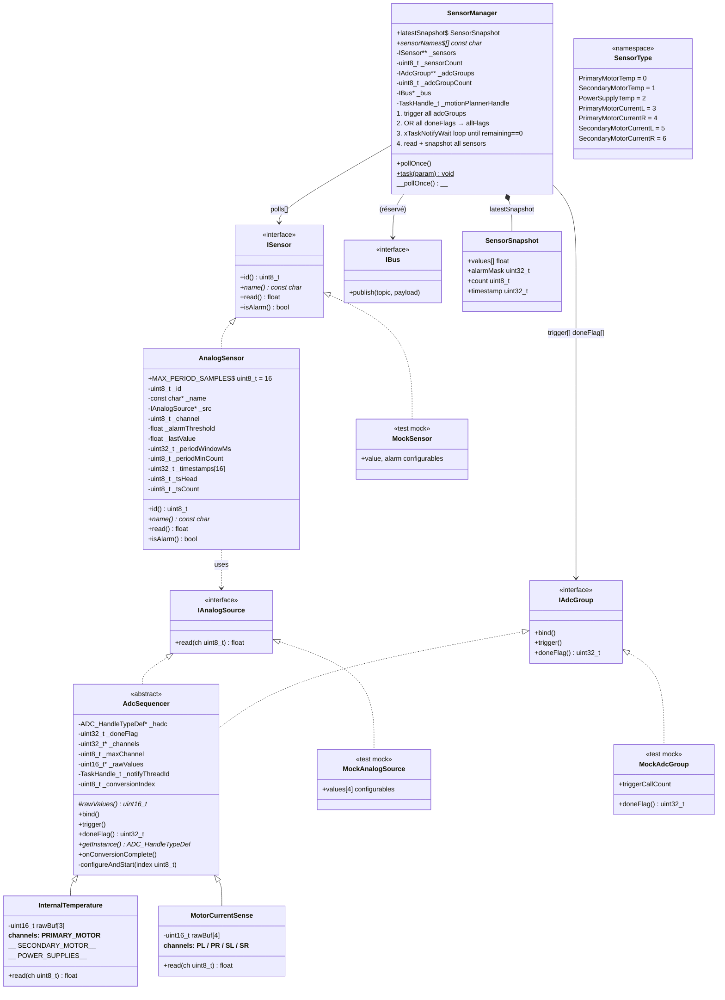
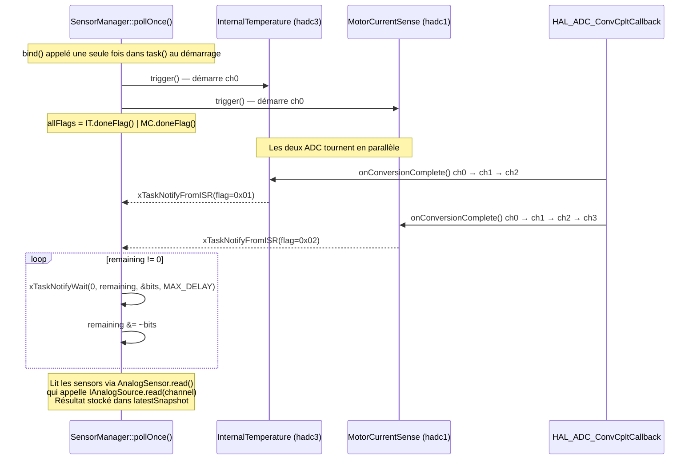

# Architecture — Sensors dans SensorManager



## Flux ISR (callbacks ADC)



## Alarme `AnalogSensor` — deux modes

| `periodWindowMs` | Comportement |
|---|---|
| `0` (défaut) | Instantané : alarme si `lastValue > alarmThreshold` |
| `> 0` | Périodique : alarme si ≥ `periodMinCount` samples au-dessus du seuil dans la fenêtre `periodWindowMs` ms (ring buffer de 16 entrées) |

## Relation IAnalogSource / ISensor

Un même `AdcSequencer` (ex: `InternalTemperature`) est injecté dans plusieurs `AnalogSensor`, chacun lisant un canal différent :

```
InternalTemperature (IAnalogSource)
    ├── AnalogSensor(id=0, "TEMP_PRI",  src, ch=0)  →  ISensor  [SensorType::PrimaryMotorTemp]
    ├── AnalogSensor(id=1, "TEMP_SEC",  src, ch=1)  →  ISensor  [SensorType::SecondaryMotorTemp]
    └── AnalogSensor(id=2, "TEMP_PWR",  src, ch=2)  →  ISensor  [SensorType::PowerSupplyTemp]

MotorCurrentSense (IAnalogSource)
    ├── AnalogSensor(id=3, "CUR_PL", src, ch=0)  →  ISensor  [SensorType::PrimaryMotorCurrentL]
    ├── AnalogSensor(id=4, "CUR_PR", src, ch=1)  →  ISensor  [SensorType::PrimaryMotorCurrentR]
    ├── AnalogSensor(id=5, "CUR_SL", src, ch=2)  →  ISensor  [SensorType::SecondaryMotorCurrentL]
    └── AnalogSensor(id=6, "CUR_SR", src, ch=3)  →  ISensor  [SensorType::SecondaryMotorCurrentR]
```

> **Note :** Les IDs numériques ci-dessus correspondent aux constantes `SensorType::*` et à l'index dans `SensorSnapshot::values[]`.
