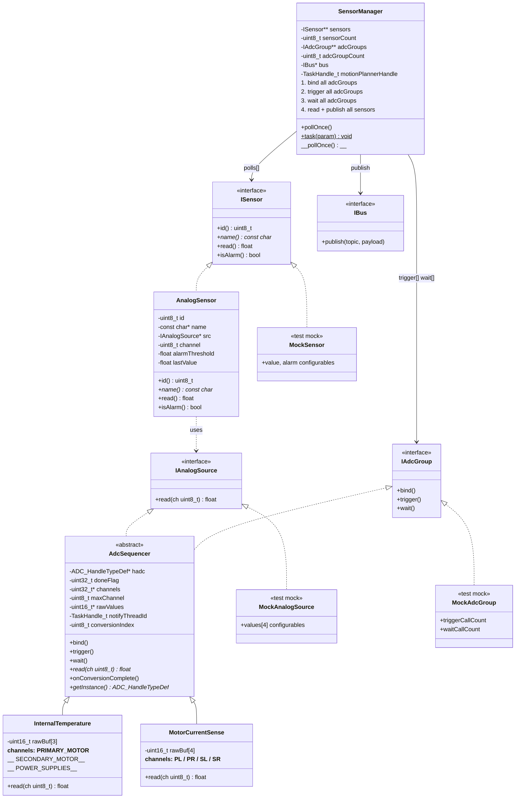
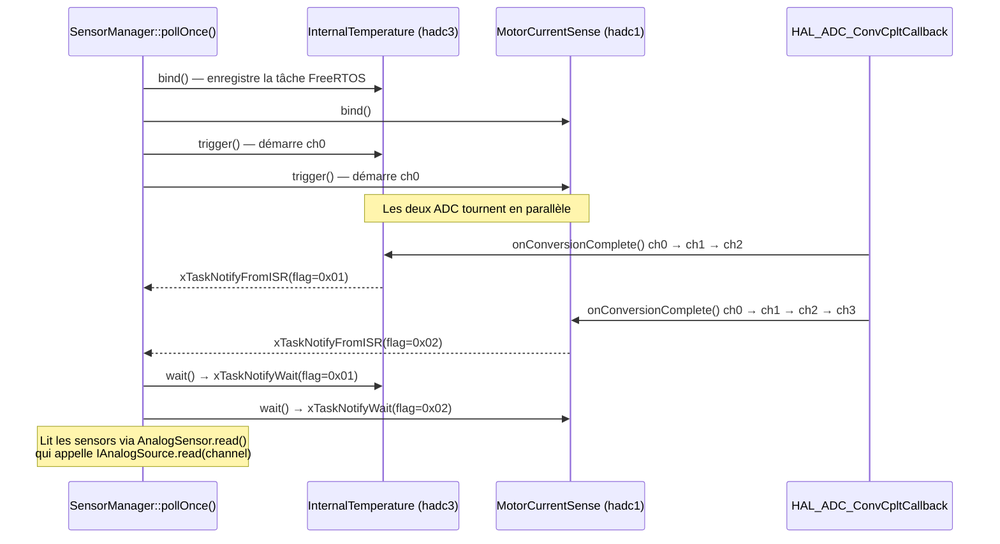

# Architecture — Sensors dans SensorManager



## Flux ISR (callbacks ADC)



## Relation IAnalogSource / ISensor

Un même `AdcSequencer` (ex: `InternalTemperature`) est injecté dans plusieurs `AnalogSensor`, chacun lisant un canal différent :

```
InternalTemperature (IAnalogSource)
    ├── AnalogSensor(id=4, "TEMP_PRI",  src, ch=0)  →  ISensor
    ├── AnalogSensor(id=5, "TEMP_SEC",  src, ch=1)  →  ISensor
    └── AnalogSensor(id=6, "TEMP_PWR",  src, ch=2)  →  ISensor

MotorCurrentSense (IAnalogSource)
    ├── AnalogSensor(id=7,  "CUR_PL", src, ch=0)   →  ISensor
    ├── AnalogSensor(id=8,  "CUR_PR", src, ch=1)   →  ISensor
    ├── AnalogSensor(id=9,  "CUR_SL", src, ch=2)   →  ISensor
    └── AnalogSensor(id=10, "CUR_SR", src, ch=3)   →  ISensor
```
