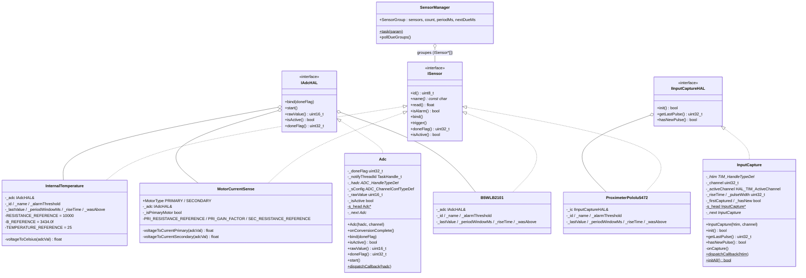
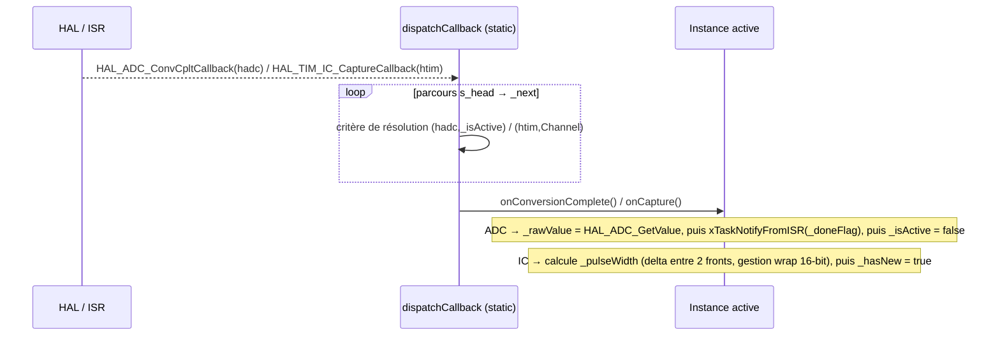
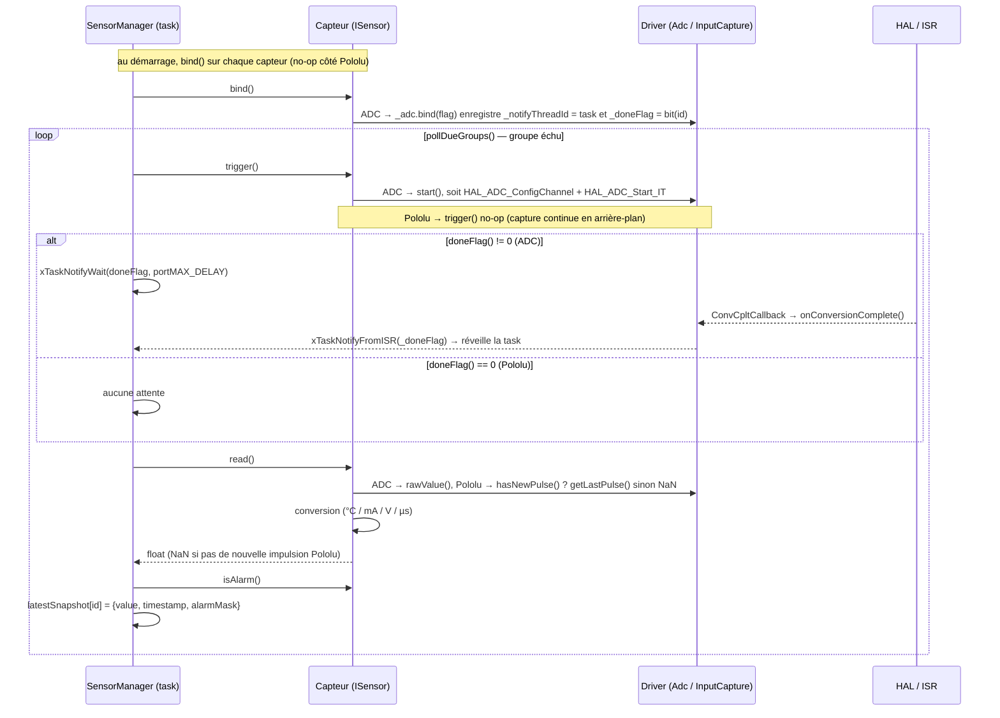

# Architecture — Capteurs (ADC + InputCapture, sous `ISensor`)

Tous les capteurs **réalisent** `ISensor` (héritage) et **détiennent** une abstraction HAL injectée (composition) — `IAdcHAL&` pour les capteurs analogiques, `IInputCaptureHAL&` pour le Pololu. Le capteur délègue l'acquisition à l'abstraction sans connaître le driver concret (`Adc` / `InputCapture`). Les drivers sont construits et injectés dans `cppMain` (composition root), un par capteur/canal, ce qui rend chaque capteur testable en hôte avec un faux HAL (`FakeAdcHAL` / `FakeInputCaptureHAL`, cf. `SensorDriversTest`).

| Capteur | Périphérique | Acquisition | Conversion | Unité |
|---|---|---|---|---|
| `InternalTemperature` | `hadc3` (canaux 4/5/6) | ADC IT, bloquant | NTC → Steinhart–Hart | °C |
| `MotorCurrentSense` | `hadc1` (canaux 3/4/6/8) | ADC IT, bloquant | pont shunt (primaire/secondaire) | mA |
| `B5WLB2101` | `hadc2` (canaux 12/10/13/9) | ADC IT, bloquant | tension brute | V |
| `ProximeterPololu5472` | `htim3` (canaux 1/2/3/4) | InputCapture IT, passif | largeur d'impulsion brute | µs |

## Deux paradigmes d'acquisition sous `ISensor`

`SensorManager` orchestre les deux de façon uniforme via `trigger()` → attente sur `doneFlag()` → `read()`. La différence tient au `doneFlag()` :

| | Capteurs ADC | `ProximeterPololu5472` (InputCapture) |
|---|---|---|
| `trigger()` | `start()` : lance une conversion non-bloquante | **no-op** (le timer capture en continu) |
| `doneFlag()` | `1 << id` → `SensorManager` attend la notif ISR | **`0`** → aucune attente, lecture immédiate |
| `read()` | convertit `rawValue()` (valeur toujours fraîche) | renvoie `getLastPulse()`, ou **`NaN`** si pas de nouvelle impulsion (`hasNewPulse() == false`) |
| Modèle | déclenché à la demande, **bloquant** sur flag de notif | **libre / piloté par l'ISR**, lecture polling non-bloquante |



## Routage des interruptions — registre intrusif statique

Les deux drivers partagent le même schéma : chaque instance s'auto-enregistre dans une liste chaînée statique (`s_head` / `_next`) au constructeur, et le callback HAL global parcourt la liste pour router l'IT vers la bonne instance.

| | `Adc::dispatchCallback(hadc)` | `InputCapture::dispatchCallback(htim)` |
|---|---|---|
| Callback HAL | `HAL_ADC_ConvCpltCallback` | `HAL_TIM_IC_CaptureCallback` |
| Critère de résolution | `_hadc == hadc && _isActive` | `_htim == htim && htim->Channel == _activeChannel` |
| Pourquoi | sur un `hadc` les canaux sont séquentiels (un seul actif), mais plusieurs `hadc` convertissent en parallèle | sur un `htim` chaque canal est une instance distincte ; `htim->Channel` désigne le canal qui a capturé |

> `InputCapture::initAll()` (appelé une fois depuis `cppMain`, après `MX_TIMx_Init`) parcourt la liste et démarre `HAL_TIM_IC_Start_IT` sur chaque instance.



## Flux acquisition → lecture (orchestré par SensorManager)



`SensorManager` regroupe les capteurs par fréquence (`SensorGroup`) et planifie chaque groupe via `nextDueMs`. Pour chaque capteur échu : `trigger()` → attente conditionnelle sur `doneFlag` (`xTaskNotifyWait`, ignorée si `doneFlag()==0`) → `read()` + `isAlarm()` → écriture dans `latestSnapshot`. Les quatre groupes (température / courant / proximité B5W / Pololu) ont chacun leur propre fréquence (`Config::*_SENSOR_FREQ_HZ`).

## Alarme — deux modes

Logique portée par chaque capteur. Mise à jour de l'état de seuil dans `read()`, décision dans `isAlarm()` (même mécanique pour ADC et Pololu).

| `periodWindowMs` | Comportement `isAlarm()` |
|---|---|
| `0` (défaut) | Instantané : `_lastValue > _alarmThreshold` |
| `> 0` | Temporel : alarme si `_wasAbove == true` **et** `HAL_GetTick() - _riseTime >= _periodWindowMs` |

## Conversions

### InternalTemperature — NTC (`voltageToCelsius`)

```
adcVal (12 bits, 0–4095)
  └─► voltage = adcVal / 4096.0 × 3.3 V
        └─► R_ntc = voltage × R_ref / (3.3 − voltage)      (pont diviseur)
              └─► T_K = 1 / (1/T_ref_K + ln(R_ntc/R_ref) / B)   (Steinhart–Hart simplifié)
                    └─► T_°C = T_K − 273.15
```

| Constante | Valeur |
|---|---|
| `RESISTANCE_REFERENCE` | 10 000 Ω |
| `B_REFERENCE` | 3434 K |
| `TEMPERATURE_REFERENCE` | 25 °C |

### MotorCurrentSense — courant

```
Primaire   : I = (adcVal/4096 × 3.3 × 1000 / PRI_GAIN_FACTOR) / PRI_RESISTANCE_REFERENCE
Secondaire : I = (adcVal/4096 × 3.3) / SEC_RESISTANCE_REFERENCE
```

| Constante | Valeur |
|---|---|
| `PRI_RESISTANCE_REFERENCE` | 3090 Ω |
| `PRI_GAIN_FACTOR` | 0.000212 |
| `SEC_RESISTANCE_REFERENCE` | 0.5 Ω |

### B5WLB2101 — tension brute

```
V = adcVal / 4096.0 × 3.3 V
```

### ProximeterPololu5472 — largeur d'impulsion

Pas de conversion : la valeur brute du driver `InputCapture` est déjà en microsecondes.

```
µs = getLastPulse()      // delta entre front montant et front suivant
                         // TIM3 16-bit, PSC = 83 @ 84 MHz → 1 tick = 1 µs
                         // NaN si aucune nouvelle impulsion depuis le dernier read()
```

> **Note architecture :** chaque capteur réalise `ISensor` (héritage) et détient une abstraction HAL injectée (composition) — `IAdcHAL&` (ADC) ou `IInputCaptureHAL&` (Pololu). Il délègue l'acquisition à l'abstraction sans connaître le driver concret (`Adc` / `InputCapture`), tous deux instanciés et injectés dans `cppMain` (composition root), un par capteur/canal. Cette inversion de dépendance rend les capteurs testables en hôte avec un faux HAL (`FakeAdcHAL` / `FakeInputCaptureHAL`, cf. `SensorDriversTest`). Le routage d'interruption passe par un registre intrusif statique propre à chaque driver (`dispatchCallback`). `ProximeterPololu5472` est désormais pleinement intégré : passif (lecture polling non-bloquante, `doneFlag()==0`), il cohabite avec les capteurs ADC bloquants sous la même orchestration `SensorManager`.
