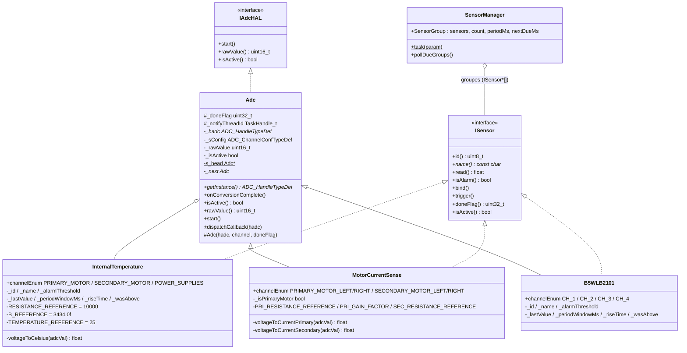
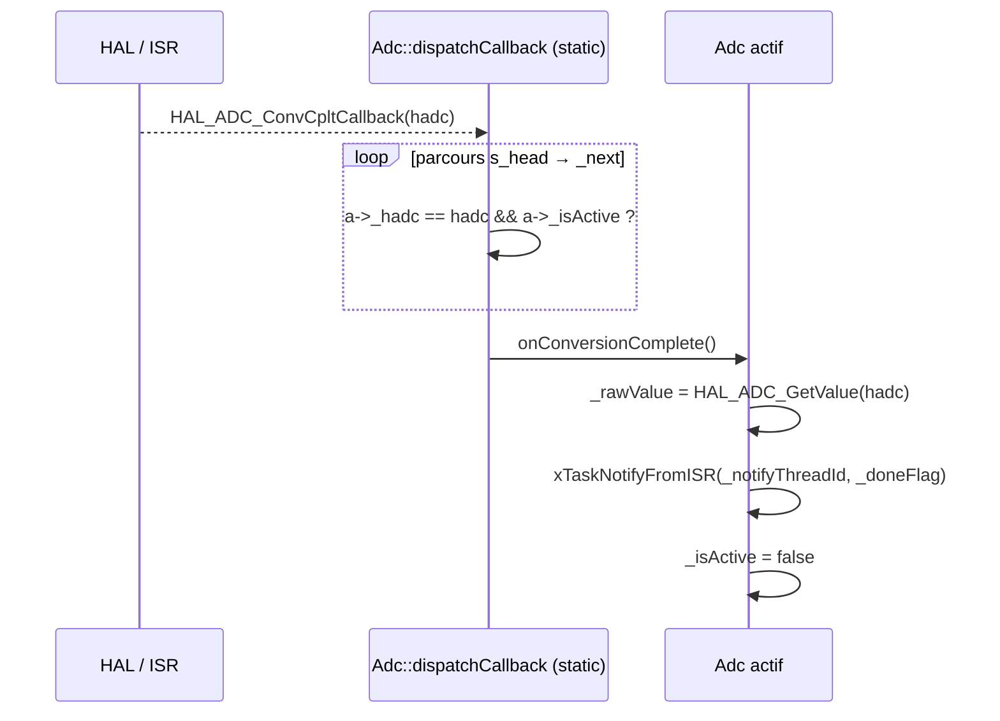
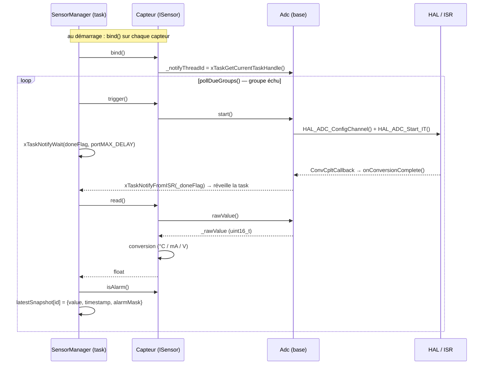

# Architecture — Capteurs ADC (Adc + ISensor)

Trois capteurs analogiques partagent la même base : le driver `Adc` (acquisition non-bloquante par interruption) et l'interface `ISensor` (contrat capteur). Chaque capteur fusionne les deux par double héritage `public Adc, public ISensor`.

| Capteur | Périphérique | Conversion | Unité |
|---|---|---|---|
| `InternalTemperature` | `hadc3` (3 canaux) | NTC → Steinhart–Hart | °C |
| `MotorCurrentSense` | `hadc1` (4 canaux) | pont shunt (primaire/secondaire) | mA |
| `B5WLB2101` | `hadc2` (4 canaux) | tension brute | V |
| `ProximeterPololu5472` | `htim3` InputCapture | *(planifié, commenté)* | µs |



## Routage des interruptions — registre intrusif statique

Contrairement à la v1, le callback de fin de conversion n'est plus lié à une instance unique. Chaque `Adc` s'auto-enregistre dans une liste chaînée statique (`s_head` / `_next`) au constructeur. Le callback HAL global parcourt la liste et route l'IT vers l'instance active du `hadc` concerné.

> Sur un même `hadc` les canaux sont séquentiels (un seul actif à la fois), mais **plusieurs `hadc` peuvent convertir en parallèle** ; la résolution se fait donc par la paire `(hadc, _isActive)`.



## Flux acquisition → lecture (orchestré par SensorManager)



`SensorManager` regroupe les capteurs par fréquence (`SensorGroup`) et planifie chaque groupe via `nextDueMs`. Pour chaque capteur échu : `trigger()` → attente bloquante sur `doneFlag` (`xTaskNotifyWait`) → `read()` + `isAlarm()` → écriture dans `latestSnapshot`.

## Alarme — deux modes

Logique portée par chaque capteur (et non plus par `Adc`). Mise à jour de l'état de seuil dans `read()`, décision dans `isAlarm()`.

| `periodWindowMs` | Comportement `isAlarm()` |
|---|---|
| `0` (défaut) | Instantané : `_lastValue > _alarmThreshold` |
| `> 0` | Temporel : alarme si `_wasAbove == true` **et** `HAL_GetTick() - _riseTime >= _periodWindowMs` |

## Conversions

### InternalTemperature — NTC (`voltageToCelsius`)

```
adcVal (12 bits, 0–4095)
  └─► voltage = adcVal / 4096.0 × 3.3 V
        └─► R_ntc = voltage × R_ref / (3.3 − voltage)      (pont diviseur)
              └─► T_K = 1 / (1/T_ref_K + ln(R_ntc/R_ref) / B)   (Steinhart–Hart simplifié)
                    └─► T_°C = T_K − 273.15
```

| Constante | Valeur |
|---|---|
| `RESISTANCE_REFERENCE` | 10 000 Ω |
| `B_REFERENCE` | 3434 K |
| `TEMPERATURE_REFERENCE` | 25 °C |

### MotorCurrentSense — courant

```
Primaire   : I = (adcVal/4096 × 3.3 × 1000 / PRI_GAIN_FACTOR) / PRI_RESISTANCE_REFERENCE
Secondaire : I = (adcVal/4096 × 3.3) / SEC_RESISTANCE_REFERENCE
```

| Constante | Valeur |
|---|---|
| `PRI_RESISTANCE_REFERENCE` | 3090 Ω |
| `PRI_GAIN_FACTOR` | 0.000212 |
| `SEC_RESISTANCE_REFERENCE` | 0.5 Ω |

### B5WLB2101 — tension brute

```
V = adcVal / 4096.0 × 3.3 V
```

> **Note architecture :** par rapport à la v1 (`AnalogSensor` + `IAnalogSource`), les capteurs ADC fusionnent désormais driver et logique capteur dans une seule classe via double héritage `Adc` + `ISensor`. Le routage d'interruption passe par un registre intrusif statique (`Adc::dispatchCallback`) au lieu d'un pointeur d'instance unique. `ProximeterPololu5472` (InputCapture sur `htim3`) reste à intégrer — le squelette est présent mais commenté.
