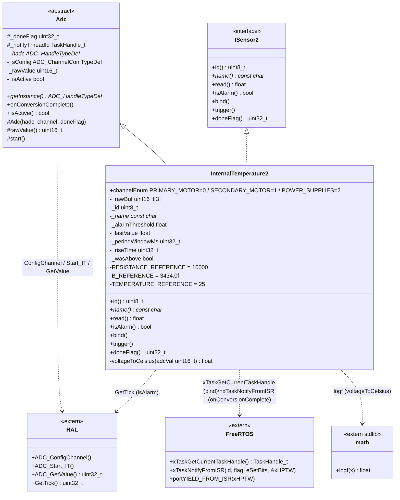
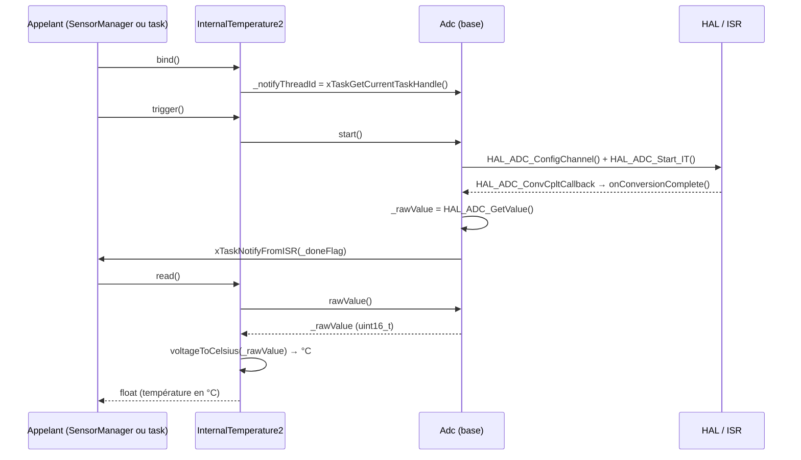

# Architecture — InternalTemperature2



## Flux acquisition → lecture



## Alarme — deux modes

| `periodWindowMs` | Comportement `isAlarm()` |
|---|---|
| `0` (défaut) | Instantané : `_lastValue > _alarmThreshold` |
| `> 0` | Temporel : alarme si `_wasAbove == true` **et** `HAL_GetTick() - _riseTime >= _periodWindowMs` |

> **Note :** contrairement à `AnalogSensor` (architecture v1), `InternalTemperature2` fusionne le driver ADC et la logique capteur dans une seule classe via double héritage `Adc` + `ISensor2`. Il n'y a pas d'intermédiaire `IAnalogSource`.

## Conversion NTC (voltageToCelsius)

```
adcVal (12 bits, 0–4095)
  └─► voltage = adcVal / 4096.0 × 3.3 V
        └─► R_ntc = voltage × R_ref / (3.3 − voltage)      (pont diviseur)
              └─► T_K = 1 / (1/T_ref_K + ln(R_ntc/R_ref) / B)   (équation Steinhart–Hart simplifiée)
                    └─► T_°C = T_K − 273.15
```

| Constante | Valeur |
|---|---|
| `RESISTANCE_REFERENCE` | 10 000 Ω |
| `B_REFERENCE` | 3434 K |
| `TEMPERATURE_REFERENCE` | 25 °C |
